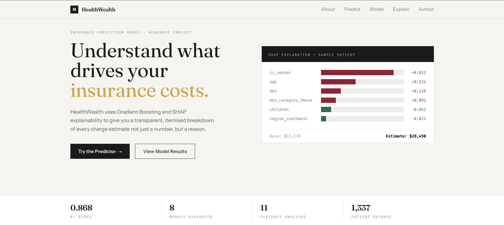
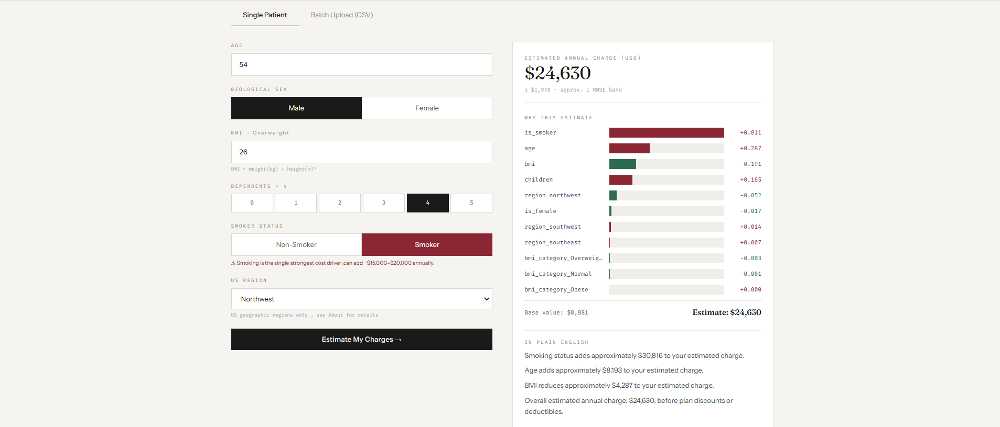
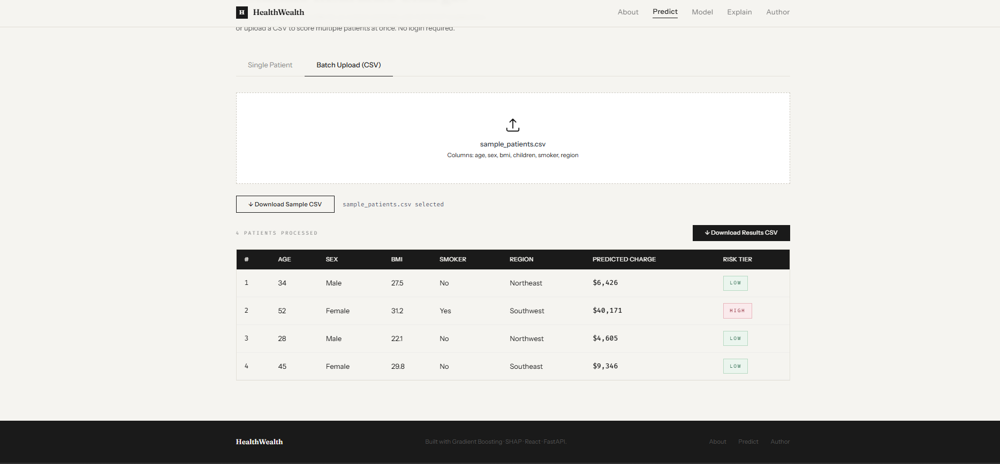
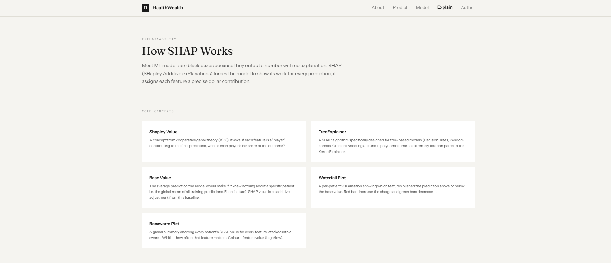

# HealthWealth

**An end-to-end explainable machine learning web application that predicts annual health insurance charges based on patient demographic and lifestyle data.**

My first ML project covering the full data science lifecycle from raw EDA through production deployment.

**Live Demo:** [insurance-charges-prediction.vercel.app](https://insurance-charges-prediction.vercel.app)  
**Backend API:** Deployed on Render (FastAPI + uvicorn)

---

## Project Overview

HealthWealth takes six patient inputs - age, sex, BMI, children, smoking status, and US region, and returns a predicted annual insurance charge along with a SHAP-powered explanation of exactly which factors drove the estimate and by how much.

The application is designed around the principle that a model that explains itself is more valuable than one that is marginally more accurate but opaque.

---

## Key Features

- **Single-patient prediction** - fill the form and get an instant charge estimate with a SHAP waterfall breakdown
- **Batch prediction** - upload a CSV of patients and download results with predicted charges and risk tiers (Low / Medium / High)
- **SHAP explainability** - every prediction comes with a ranked list of feature contributions in plain English, not just a number
- **Model registry page** - full 8-model leaderboard with R², MAE, and RMSE, SHAP feature importance bars, and Pearson correlation table
- **Explain page** - interactive walkthrough of how SHAP works, the SVR vs Gradient Boosting trade-off, and why explainability was prioritised over raw accuracy

---

## Machine Learning Pipeline

### Dataset
- Source: [Medical Cost Personal Dataset](https://www.kaggle.com/datasets/mirichoi0218/insurance) — 1,337 rows, 6 features
- Target: `charges` (annual insurance cost in USD)

### Preprocessing
- Train/test split (80/20) applied **before** any scaling to prevent data leakage
- StandardScaler fitted on training set only, applied to `age`, `bmi`, and `children`
- BMI binned into four WHO categories: Underweight, Normal, Overweight, Obese
- Categorical variables one-hot encoded: `sex`, `smoker`, `region`
- Final feature set: 11 columns post-encoding

### Models Evaluated

| Rank | Model | R² | Notes |
|---|---|---|---|
| 1 | SVR (RBF) | 0.8813 | Highest R² — ruled out; KernelExplainer too slow for production SHAP |
| **2** | **Gradient Boosting** | **0.8810** | **Selected — TreeExplainer compatible, 0.03% below SVR** |
| 3 | Decision Tree (tuned) | 0.8709 | Good interpretability; overfits without pruning |
| 4 | Random Forest (tuned) | 0.8420 | Stable bagging ensemble |
| 5 | ElasticNet | 0.8254 | Linear assumptions limit performance |
| 6 | Lasso | 0.8251 | Automatic feature selection |
| 7 | Linear Regression | 0.8248 | Baseline |
| 8 | KNN | 0.7202 | Sensitive to scale; no native feature importance |

All metrics computed on the log-transformed target. The `exp()` inverse transform is applied at inference time.

### Model Selection Rationale
SVR achieved the highest R² but requires SHAP's `KernelExplainer`, a model-agnostic method that samples 1,337 rows and took 20+ minutes locally, threatening RAM exhaustion entirely. Gradient Boosting was selected for its native compatibility with SHAP's `TreeExplainer`, which runs in milliseconds with exact (not approximate) Shapley values. The 0.02% accuracy difference is irrelevant compared to the gain in explainability and production feasibility.

### SHAP Explainability
- Explainer: `shap.TreeExplainer`, exact Shapley values, sub-second inference
- Top features by mean absolute SHAP value: `is_smoker` (0.50), `age` (0.43), `children` (0.10), `bmi` (0.08)
- SHAP values are in log-charge space; dollar impact is computed as `prediction × (exp(shap_val) − 1)`

---

## Screenshots & Demo

### Video Demo
Watch the full end-to-end demonstration of the HealthWealth platform below. This video showcases the entire user flow, from single patient predictions with SHAP explainability to the batch processing capabilities.

<video src="https://github.com/khushishahs02/exploratory-data-analysis/raw/dev/screenshots/Insurance_Charge_Prediction.mp4" controls="controls" style="max-width: 100%;">
  Your browser does not support the video tag.
</video>

*(If the video does not load, you can [view or download it directly here](https://github.com/khushishahs02/exploratory-data-analysis/raw/dev/screenshots/Insurance_Charge_Prediction.mp4))*

### Screenshots
**Landing Page**  


**Single Patient Prediction**  


**Batch Prediction**  


**SHAP Explanation**  


---

## Tech Stack

| Layer | Technology |
|---|---|
| Frontend | React 18, React Router, Tailwind CSS, Vite |
| Charts | Recharts |
| Backend | FastAPI, uvicorn |
| ML | scikit-learn 1.7.2, SHAP 0.46.0, pandas, numpy |
| Model serialisation | joblib |
| Frontend hosting | Vercel |
| Backend hosting | Render (Python web service) |

---

## Repository Structure

```
insurance-charges-prediction/
├── backend/
│   ├── main.py               FastAPI app — predict, batch predict, health check
│   ├── requirements.txt      Pinned Python dependencies
│   ├── gb_model.pkl          Trained Gradient Boosting model (joblib)
│   ├── scaler.pkl            Fitted StandardScaler (joblib)
│   ├── .python-version       Python 3.11.6 pin for Render
│   └── runtime.txt           runtime.txt for Render Python version detection
├── src/
│   ├── pages/
│   │   ├── HomePage.jsx      Landing page with live SHAP demo widget
│   │   ├── PredictPage.jsx   Single + batch prediction interface
│   │   ├── ModelPage.jsx     Leaderboard, SHAP importance, correlation table, notebook plots
│   │   ├── ExplainPage.jsx   SHAP methodology, waterfall walkthrough, SVR trade-off
│   │   ├── AboutPage.jsx     Project scope, sample patient, feature guide
│   │   └── AuthorPage.jsx    Author bio, GitHub + LinkedIn links, concepts covered
│   ├── components/
│   │   ├── SingleForm.jsx    Patient input form + SHAP results display
│   │   ├── BatchUpload.jsx   CSV drag-drop upload + downloadable results table
│   │   ├── ShapChart.jsx     Horizontal SHAP bar chart component
│   │   ├── AboutModel.jsx    Model card + beeswarm dot visualisation
│   │   ├── ModelPerf.jsx     Leaderboard table component
│   │   ├── Navbar.jsx        Sticky navigation with active route highlighting
│   │   ├── Footer.jsx        Site footer with page links
│   │   └── Banner.jsx        Academic disclaimer banner
│   ├── api.js                Centralised fetch functions for all API calls
│   ├── App.jsx               Root component + router
│   ├── main.jsx              ReactDOM entry point
│   └── index.css             Tailwind base + custom design tokens
├── public/
│   ├── favicon.svg           SVG favicon (dark + gold heartbeat line)
│   └── plots/                Notebook-generated SHAP and EDA plots (PNG)
├── notebooks/                Jupyter notebooks (EDA, Preprocessing, Modelling)
├── data/                     Raw and processed CSV datasets
├── render.yaml               Render deployment configuration
├── vite.config.js            Vite config with API proxy for local dev
├── tailwind.config.js        Tailwind theme with custom font and colour tokens
├── index.html                HTML entry point with fonts and favicon
└── package.json
```

---

## API Endpoints

| Method | Endpoint | Description |
|---|---|---|
| `POST` | `/api/predict` | Predict charge for a single patient (JSON body) |
| `POST` | `/api/predict-batch` | Predict charges for a CSV file upload |
| `GET` | `/api/health` | Health check - returns model type and feature list |

### Single predict request body
```json
{
  "age": 34,
  "sex": "female",
  "bmi": 28.5,
  "children": 2,
  "smoker": "no",
  "region": "northeast"
}
```

### Single predict response
```json
{
  "prediction": 7234.12,
  "base_value": 8912.44,
  "shap_values": [
    { "feature": "is_smoker", "value": -0.48 },
    { "feature": "age", "value": 0.21 }
  ],
  "plain_english": [
    "Smoking status reduces approximately $3,200 to your estimated charge.",
    "Age adds approximately $1,800 to your estimated charge.",
    "Overall estimated annual charge: $7,234, before plan discounts or deductibles."
  ]
}


```

### Local Development

### Prerequisites
- Node.js 18+
- Python 3.11+

### Frontend
```bash
npm install
npm run dev
# Runs on http://localhost:5173
# Vite proxies /api/* to localhost:8000 automatically
```

### Backend
```bash
cd backend
pip install -r requirements.txt
uvicorn main:app --reload
# Runs on http://localhost:8000
# Docs available at http://localhost:8000/docs
```

---

## Deployment

### Backend — Render
1. Connect the GitHub repository to Render as a Web Service
2. Set **Root Directory** to `backend`
3. Build command: `pip install --upgrade pip && pip install --no-cache-dir -r requirements.txt`
4. Start command: `uvicorn main:app --host 0.0.0.0 --port $PORT`
5. The `render.yaml` at the project root configures this automatically via Blueprint

### Frontend — Vercel
1. Connect the GitHub repository to Vercel
2. Root directory: `.` (project root)
3. Add environment variable: `VITE_API_URL` = your Render service URL (no trailing slash)
4. Deploy - Vercel runs `npm run build` and serves the `dist/` output

## Author

**Khushi Shah** - ICT CS Student  
[GitHub](https://github.com/khushishahs02) · [LinkedIn](https://www.linkedin.com/in/khushi-shah-047761287/)

> This project is an academic portfolio demonstration of an end-to-end supervised regression pipeline. It is not intended for real actuarial, underwriting, or financial guidance.
